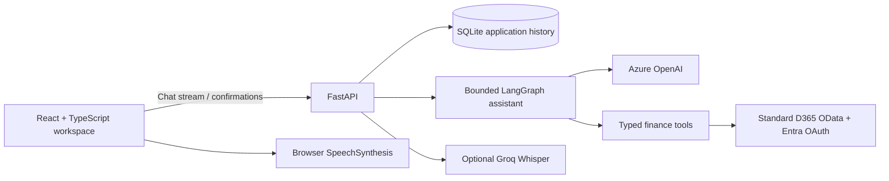

# D365 Finance Assistant

A finance workspace for Dynamics 365 Finance & Operations: ask questions about customers, open invoices and payments, inspect the ERP records behind an answer, and review a confirmation before any supported write. Finance totals are calculated in Python with `Decimal`; Dynamics 365 remains the source of truth.



## Features

- Streaming chat, persistent conversations, finance evidence cards and invoice details.
- Dynamics 365 connection status, reconnect and metadata-based transaction capability discovery.
- Outstanding balances grouped by currency, overdue analysis, payment history and draft collection reminders.
- Confirmation-gated customer and draft invoice CRUD; unposted customer payment journal preparation; audit history.
- Synthetic mock mode for development without ERP or AI credentials.
- Optional Groq speech input and browser-native speech output.
- Light/dark themes, keyboard-friendly controls and a responsive finance workspace.

Posting and settlement remain manual in Dynamics 365. The application does not modify or delete posted accounting transactions.

## Stack

React, strict TypeScript, Vite, Tailwind CSS, Radix primitives, TanStack Query and React Router; Python 3.13.3, FastAPI, Pydantic v2, async SQLAlchemy, Alembic, SQLite, httpx, LangGraph and Azure OpenAI. Vitest/Testing Library and pytest cover the application without live external services.

## Quick start

Install **Python 3.13.3**, Node.js 22 LTS and Git, then clone the repository. Setup and development launchers require that exact Python patch version, including for an existing virtual environment. See [venv recreation](guide.md#mismatched-virtual-environment) when upgrading an existing checkout.

Windows PowerShell:

```powershell
git clone https://github.com/SriTharoon05/D365_FinanceAssistantAgent.git
cd D365_FinanceAssistantAgent
.\scripts\setup.ps1
.\scripts\dev.ps1 -Mock
```

macOS/Linux:

```bash
git clone https://github.com/SriTharoon05/D365_FinanceAssistantAgent.git
cd D365_FinanceAssistantAgent
bash scripts/setup.sh
bash scripts/dev.sh --mock
```

Open **http://localhost:5173**. The API is **http://localhost:8000** and Swagger is **http://localhost:8000/docs**. Mock mode is visibly synthetic and sends no D365 requests. Without mock mode or configured credentials, the app starts with disconnected integrations and preserves access to saved chats.

For live use, edit **`backend/.env`**, restart the backend and omit `-Mock` / `--mock`. Keep frontend configuration in **`frontend/.env`**. The [developer guide](guide.md) explains every setting, Windows manual setup, entity discovery, voice, migrations, tests and live validation.

If D365 stays **Connecting**, keep Uvicorn running and inspect the status JSON from a second PowerShell window. A local status endpoint returning HTTP 200 confirms that the API answered; inspect the JSON stage and error summary. Authentication/customer checks have a 60-second budget, followed by a separate 180-second metadata budget: the default maximum is 240 seconds. Later reconnects can reuse a valid structural schema cache while checking ERP permissions afresh. Existing `.env` files need no new values for this fix; update and restart the backend. See [connection troubleshooting](guide.md#d365-stays-connecting-or-reconnecting) for safe checks and optional settings.

For unavailable balances, the resolver now supports an existing `CustTransBiEntities` set with validated canonical settlement fields, deriving current remaining transaction-currency amounts as `AmountCur - SettleAmountCur`. Stop the dev servers, run `git pull --ff-only` and restart; `D365_OPEN_TRANSACTIONS_ENTITY=auto` needs no `.env` change. See [current balances and settlement fields](guide.md#current-balances-and-settlement-fields) for an explicit override and D365 reconciliation checks. Overdue date cutoffs apply to current remaining amounts; historical balances are not reconstructed. This adapter has not been reconciled against your live tenant.

## Checks

```powershell
cd backend
.\.venv\Scripts\python.exe -m ruff check app tests
.\.venv\Scripts\python.exe -m ruff format --check app tests
.\.venv\Scripts\python.exe -m pytest
cd ..\frontend
npm run lint
npm run format:check
npm run test -- --run
npm run build
```

GitHub Actions runs lint, formatting, migrations, unit tests, production build and Chromium smoke tests without ERP or AI credentials. See [the guide](guide.md#browser-smoke-tests) for local Playwright commands.

The initial implementation was verified locally with **74 backend tests, 35 frontend tests and 2 Chromium smoke tests passing**, along with lint, formatting, migrations and the production build. Live D365, Azure OpenAI and Groq calls require your credentials and have not been validated against your services.

## Security and deployment

Secrets stay server-side and are excluded from Git. SQLite stores application history and audit data, not ERP tokens or credentials. ERP mutations require an expiring server-side confirmation and a fresh safety check.

The bundled session model supports one local user: a signed cookie identifies the local workspace automatically. It is **not an enterprise login or a multi-user authorization boundary**. Keep development servers local. Before hosting, put the app behind authenticated SSO and TLS, add per-user authorization, use a managed secret store and review the [deployment checklist](guide.md#production-deployment).
